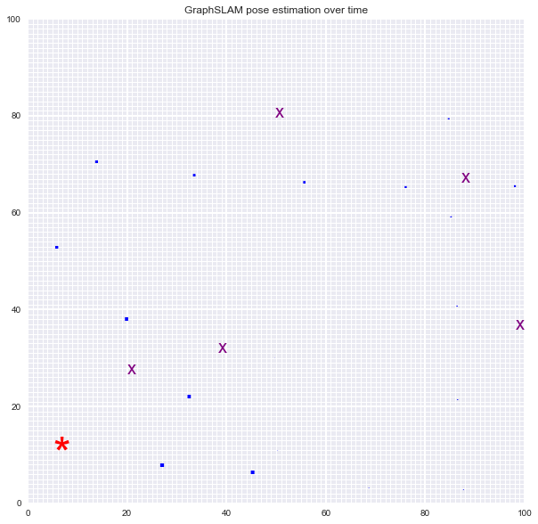

# Landmark Detection & Robot Tracking (SLAM)

## Project Overview

In this project implements  GraphSLAM (Simultaneous Localization and Mapping) algorithm for a 2 dimensional world. In the project will be combined the information from robot sensor measurements and movement to create a map of an environment from only sensor and motion data gathered by a robot, over time. SLAM gives you a way to track the location of a robot in the world in real-time and identify the locations of landmarks such as buildings, trees, rocks, and other world features. This is an active area of research in the fields of robotics and autonomous systems.

Originally, inspired to the project required as part of the program: Udacity Computer Vision Nanodegree, it is here presented with some improvements in the world visualization.

*Below is an example of a 2D robot world with landmarks (purple x's) and the robot (a red star) located and found using only sensor and motion data collected by that robot. Additionally, the small dots represent the path of the robot over time*

<p align="center">
  
</p>

The project will be broken up into three Python notebooks and a .py script. The first two notebooks are used to develop the relevant code and explore the matrix that will be used to perform the calculation of the GraphSLAM algorithm. Differently, notebook number 3 and the robot_class.py are used to validate the implementation of the algorithm.

__Notebook 1__ : Development notebook of Robot Moving and Sensing

__Notebook 2__ : Exploring notebook of the Omega and Xi, Constraints code structure

__Notebook 3__ : Implementation of the GraphSLAM algorithm to perform Landmark Detection and Tracking

__robot_class.py__ : Class containing Robot moving, sensing and other functions to support the implementation and testing of the algorithm.


## Project Instructions

All of the starting code and resources you'll need to complete this project are in this Github repository. Before you can get started coding, you'll have to make sure that you have all the libraries and dependencies required to support this project.

### Local Environment Instructions

1. Clone the repository, and navigate to the downloaded folder.
```
git clone https://github.com/FrancescoMrn/Landmark_Detection_and_Tracking_SLAM.git
cd Landmark_Detection_and_Tracking_SLAM
```

2. Create (and activate) a new environment, named `graphslam` with Python 3.6. If prompted to proceed with the install `(Proceed [y]/n)` type y.

	- __Linux__ or __Mac__:
	```
	conda create -n graphslam python=3.6
	source activate graphslam
	```
	- __Windows__:
	```
	conda create --name graphslam python=3.6
	activate graphslam
	```

6. Install a few required pip packages, which are specified in the requirements text file (including OpenCV).
```
pip install -r requirements.txt
```

7. Run ```jupyter notebook``` to excute and edit the code.

## Possible improvements

- Improve code to better evaluate the noise effects
- Implement and evaluate [Active Neural Localization](https://github.com/devendrachaplot/Neural-Localization)
- Rewrite code to run in hardware i.e arduino or Jetson Nano

LICENSE: This project is licensed under the terms of the MIT license.
